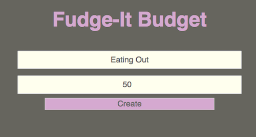
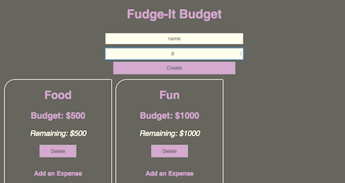
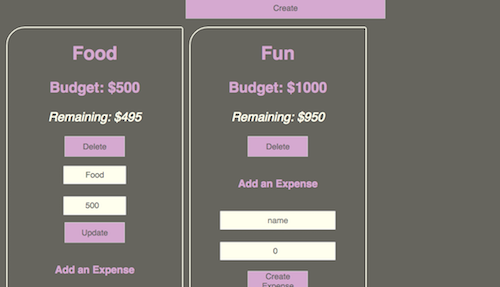
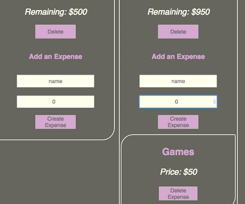

# 34 UI Design and Styling

This is a budget making application. A user may create, update and delete budgets as well as view all items they have created in their dashboard. Once a category is created, the user may then add expenses to that category. The user may also delete and update these expenses.

To create a budget, type in the name of your budget and a dollar limit, then press `Create`.

Each item will be added to the dashboard as it is created.

To update an item, double click on the name of the category, this will pop up an update form. Type in any values you wish to change and press `Update`.

If you wish to delete a budget item, simply click on the `Delete` button.

Same for creating updating, and deleting expenses. Adding an expense will also deduct from the 'Remaining' amount.

